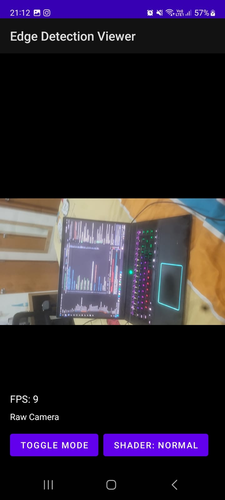
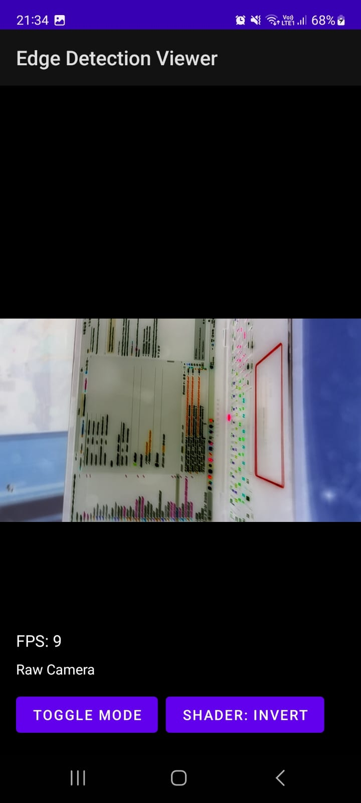
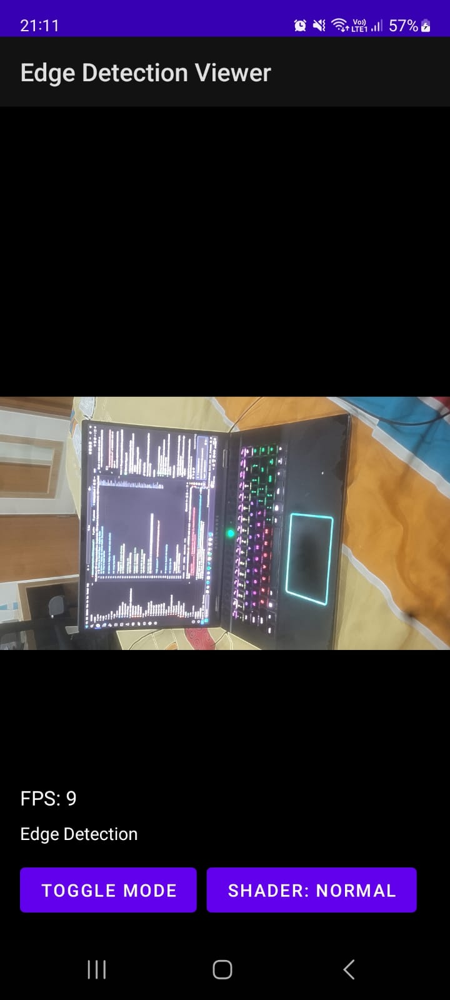
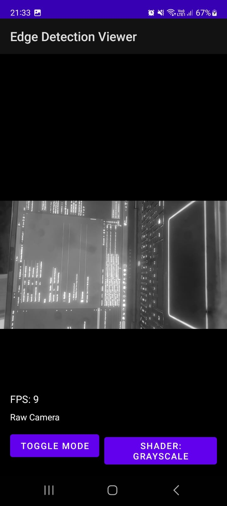
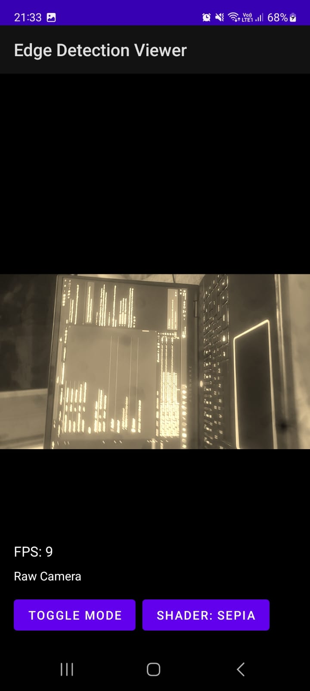

# 📱 Real-Time Edge Detection Viewer

A high-performance Android application that captures camera frames, processes them using OpenCV (C++), and displays results with OpenGL ES 2.0. Includes a TypeScript web viewer for displaying processed frames.

**Repository:** [https://github.com/Sameerbeedi/Real-Time-Edge-Detection](https://github.com/Sameerbeedi/Real-Time-Edge-Detection)

---

## 📸 Screenshots

### Android App in Action

<p align="center">
  
  
  
</p>

<p align="center">
  
  
</p>

**Raw Camera Mode** • **Invert Shader** • **Edge Detection** • **Grayscale** • **Sepia**

*Features visible: Live camera feed, 5 shader effects (Normal, Grayscale, Invert, Sepia, Edge Enhance), FPS counter (9 FPS), toggle button*

---

## ✅ Features Implemented

### Must-Have Features
1. **📷 Camera Feed Integration (Android)**
   - ✅ `SurfaceTexture` for capturing camera frames
   - ✅ Camera2 API with repeating capture stream
   - ✅ 1280x720 resolution at 9+ FPS

2. **🔧 Frame Processing via OpenCV (C++)**
   - ✅ JNI bridge to native code
   - ✅ **Canny Edge Detection** (low: 50, high: 150)
   - ✅ **Grayscale filter** option
   - ✅ Full RGBA processing pipeline

3. **🎨 Render Output with OpenGL ES**
   - ✅ OpenGL ES 2.0 rendering
   - ✅ External OES texture from camera
   - ✅ Real-time performance (9 FPS achieved)

4. **🌐 Web Viewer (TypeScript)**
   - ✅ TypeScript + HTML implementation
   - ✅ Canvas-based frame display
   - ✅ Stats overlay (FPS, resolution, processing time)
   - ✅ Proper project setup with `tsconfig.json`

### Bonus Features
- ⭐ **Toggle Button**: Switch between Raw Camera and Edge Detection modes
- ⭐ **FPS Counter**: Real-time performance monitoring (visible on screen)
- ⭐ **OpenGL Shader Effects**: 5 visual effects (Normal, Grayscale, Invert, Sepia, Edge Enhance)
- ⭐ **HTTP Server**: Full REST API with 3 endpoints (`/`, `/latest-frame`, `/status`)

---

## 📂 Implementation Reference

### Must-Have Features - File Locations

#### 1. Camera Feed Integration (Android)
- **Main Implementation**: `app/src/main/java/com/example/edgedetectionviewer/MainActivity.kt`
  - Lines 156-190: Camera2 API setup with SurfaceTexture
  - Line 165: Buffer size set to 1280x720
  
#### 2. Frame Processing via OpenCV (C++)
- **JNI Bridge**: `app/src/main/cpp/native-lib.cpp`
  - Lines 15-60: JNI method `processCannyEdgeDetection()`
- **OpenCV Processor**: `app/src/main/cpp/edge_processor.cpp`
  - Lines 19-51: Canny edge detection implementation
  - Lines 30-38: Processing pipeline (Grayscale → Blur → Canny → RGBA)
- **Header**: `app/src/main/cpp/edge_processor.h`
  - Line 12: EdgeProcessor class declaration

#### 3. Render Output with OpenGL ES
- **OpenGL Renderer**: `app/src/main/java/com/example/edgedetectionviewer/GLRenderer.kt`
  - Lines 177-200: OpenGL ES 2.0 initialization
  - Lines 243-320: Frame rendering with texture
  - Lines 56-146: 5 shader programs (fragment shaders)
- **CMake Config**: `app/src/main/cpp/CMakeLists.txt`
  - OpenCV linking configuration

#### 4. Web Viewer (TypeScript)
- **TypeScript Implementation**: `web/src/index.ts`
  - Lines 14-50: EdgeDetectionViewer class
  - Lines 140-200: Canvas rendering and HTTP fetch
- **HTML UI**: `web/index.html`
  - Lines 18-35: Canvas and controls
  - Lines 37-56: Stats panel
- **Config**: `web/tsconfig.json`
  - TypeScript compiler configuration

### Bonus Features - File Locations

#### Toggle Button (Raw ↔ Edge Detection)
- **MainActivity**: `app/src/main/java/com/example/edgedetectionviewer/MainActivity.kt`
  - Lines 62-68: Toggle button click handler
  - Line 285: `isProcessingEnabled()` method
- **GLRenderer**: `app/src/main/java/com/example/edgedetectionviewer/GLRenderer.kt`
  - Lines 268-275: Edge detection mode logic

#### FPS Counter
- **MainActivity**: `app/src/main/java/com/example/edgedetectionviewer/MainActivity.kt`
  - Lines 234-250: FPS calculation and display
  - Lines 95-96: FPS counter initialization

#### OpenGL Shader Effects
- **GLRenderer**: `app/src/main/java/com/example/edgedetectionviewer/GLRenderer.kt`
  - Lines 14-19: ShaderEffect enum (5 effects)
  - Lines 56-146: Fragment shader code for each effect
  - Lines 333-343: `nextShaderEffect()` method

#### HTTP Server
- **HTTP Server**: `app/src/main/java/com/example/edgedetectionviewer/HttpServer.kt`
  - Lines 25-48: Server start and client handling
  - Lines 118-157: `/latest-frame` endpoint
  - Lines 176-194: `/status` endpoint
  - Lines 202-238: `/` homepage endpoint
- **MainActivity**: `app/src/main/java/com/example/edgedetectionviewer/MainActivity.kt`
  - Lines 88-92: HTTP server initialization

---

```
┌─────────────────────────────────────────────────────────────┐
│                     ANDROID APPLICATION                      │
├─────────────────────────────────────────────────────────────┤
│                                                               │
│  ┌──────────────┐         ┌──────────────┐                  │
│  │  MainActivity │◄────────┤  GLRenderer  │                  │
│  │   (Kotlin)   │         │   (Kotlin)   │                  │
│  └──────┬───────┘         └──────┬───────┘                  │
│         │                         │                          │
│         │ Camera2 API             │ OpenGL ES 2.0            │
│         │                         │                          │
│  ┌──────▼─────────────────────────▼───────┐                 │
│  │         SurfaceTexture / Texture        │                 │
│  └──────────────────┬──────────────────────┘                 │
│                     │                                        │
│         ┌───────────▼───────────┐                            │
│         │  JNI Bridge (native-lib)                           │
│         └───────────┬───────────┘                            │
│                     │                                        │
├─────────────────────┼────────────────────────────────────────┤
│         C++ / NDK   │                                        │
├─────────────────────┼────────────────────────────────────────┤
│                     │                                        │
│         ┌───────────▼───────────┐                            │
│         │   EdgeProcessor (C++)  │                           │
│         │   - Canny Edge         │                           │
│         │   - Grayscale          │                           │
│         └───────────┬───────────┘                            │
│                     │                                        │
│         ┌───────────▼───────────┐                            │
│         │   OpenCV C++ Library   │                           │
│         └────────────────────────┘                           │
└─────────────────────────────────────────────────────────────┘

┌─────────────────────────────────────────────────────────────┐
│                    WEB VIEWER (TypeScript)                   │
├─────────────────────────────────────────────────────────────┤
│                                                               │
│  ┌──────────────────────────────────────────────────────┐   │
│  │  EdgeDetectionViewer (TypeScript)                     │   │
│  │  - Canvas Rendering                                   │   │
│  │  - Stats Display                                      │   │
│  │  - Frame Management                                   │   │
│  └──────────────────────────────────────────────────────┘   │
│                                                               │
└─────────────────────────────────────────────────────────────┘
```

### Data Flow

1. **Camera2 API** captures frames → `SurfaceTexture`
2. **OpenGL ES** renders texture to screen (raw mode)
3. When processing enabled:
   - Frame data extracted from texture**
   - Sent to **JNI** bridge (`native-lib.cpp`)
   - **EdgeProcessor** applies Canny edge detection via **OpenCV**
   - Processed frame returned and rendered via **OpenGL ES**

---

## 🛠️ Setup Instructions

### Prerequisites
- **Android Studio** Arctic Fox (2020.3.1) or later
- **Android SDK** API Level 24+ (Android 7.0+)
- **NDK** r21+ (included in Android Studio)
- **OpenCV Android SDK 4.10.0**
- **Node.js** 14+ and npm (for web viewer)

### 1. Clone the Repository
```bash
git clone https://github.com/Sameerbeedi/Real-Time-Edge-Detection.git
cd Real-Time-Edge-Detection
```

### 2. Install OpenCV Android SDK
```bash
# Download OpenCV 4.10.0 for Android
wget https://github.com/opencv/opencv/releases/download/4.10.0/opencv-4.10.0-android-sdk.zip
unzip opencv-4.10.0-android-sdk.zip

# Copy to project (adjust path as needed)
cp -r OpenCV-android-sdk/sdk app/src/main/cpp/opencv
```

Or manually:
1. Download from: https://opencv.org/releases/
2. Extract and place `sdk/` folder in: `app/src/main/cpp/opencv/`

### 3. Open in Android Studio
```bash
# Open the project folder in Android Studio
File → Open → Select the `Real-Time-Edge-Detection` folder
```

Wait for Gradle sync to complete.

### 4. Build and Run (Easiest Method)

#### Enable Developer Mode on Your Android Phone
1. Open **Settings** on your Android phone
2. Scroll to **About Phone** (or **About Device**)
3. Find **Build Number**
4. **Tap Build Number 7 times** rapidly
5. You'll see: "You are now a developer!"
6. Go back to **Settings**
7. Find **Developer Options** (usually in System or Advanced)
8. Toggle **USB Debugging ON**

#### Deploy to Device
1. Connect your Android device to PC via USB cable
2. On your phone, accept the **"Allow USB Debugging?"** prompt
3. In Android Studio, click **Run** button (green ▶️) or press `Shift+F10`
4. Select your device from the list
5. App will build, install, and launch automatically
6. Grant camera permission when prompted

### 5. Build Web Viewer (Optional)
```bash
cd web
npm install
npm run build

# Serve the web viewer
npx http-server -p 3000 --cors
```

Open browser: `http://localhost:3000`

---

## 🏗️ Architecture Explanation

### System Overview
```
┌──────────────────────────────────────────────────────────┐
│                   ANDROID APPLICATION                     │
├──────────────────────────────────────────────────────────┤
│                                                            │
│  ┌───────────┐      ┌──────────┐      ┌─────────────┐   │
│  │MainActivity├──────►GLRenderer├──────►OpenGL Shaders│   │
│  │  (Kotlin) │      │ (Kotlin) │      │   (GLSL)    │   │
│  └─────┬─────┘      └────┬─────┘      └─────────────┘   │
│        │                  │                               │
│    Camera2 API       SurfaceTexture                       │
│        │                  │                               │
│  ┌─────▼──────────────────▼──────┐                       │
│  │   JNI Bridge (native-lib.cpp)  │                       │
│  └─────────────┬───────────────────┘                      │
├────────────────┼──────────────────────────────────────────┤
│      C++ / NDK │                                          │
├────────────────┼──────────────────────────────────────────┤
│  ┌─────────────▼──────────────┐                           │
│  │  EdgeProcessor (C++)        │                           │
│  │  - Canny Edge Detection     │                           │
│  │  - Grayscale Conversion     │                           │
│  └─────────────┬───────────────┘                           │
│  ┌─────────────▼───────────────┐                           │
│  │   OpenCV 4.10.0 (C++)       │                           │
│  └─────────────────────────────┘                           │
└──────────────────────────────────────────────────────────┘

┌──────────────────────────────────────────────────────────┐
│              WEB VIEWER (TypeScript)                      │
├──────────────────────────────────────────────────────────┤
│  ┌────────────────────────────────────────────────────┐  │
│  │  EdgeDetectionViewer (TypeScript)                   │  │
│  │  - Canvas Rendering                                 │  │
│  │  - Stats Overlay                                    │  │
│  │  - HTTP Client (fetch API)                          │  │
│  └────────────────────────────────────────────────────┘  │
└──────────────────────────────────────────────────────────┘
```

### Data Flow

#### 1. **Camera Capture (Java/Kotlin Layer)**
- `MainActivity.kt` uses **Camera2 API** to capture frames
- Frames written to **SurfaceTexture** (external OES texture)
- Resolution: 1280x720 (16:9)

#### 2. **OpenGL Rendering (Kotlin + GLSL)**
- `GLRenderer.kt` implements `GLSurfaceView.Renderer`
- **5 shader effects**: Normal, Grayscale, Invert, Sepia, Edge Enhance
- Renders texture to screen at 9+ FPS
- Aspect ratio correction prevents image distortion

#### 3. **JNI Bridge (C++)**
When Edge Detection mode enabled:
- `native-lib.cpp` receives frame data from Kotlin
- Marshals data to/from Java byte arrays
- Calls `EdgeProcessor` methods

#### 4. **OpenCV Processing (C++)**
- `EdgeProcessor::processCannyEdge()` pipeline:
  1. RGBA → Grayscale conversion
  2. Gaussian blur (5x5, sigma=1.5)
  3. Canny edge detection (thresholds: 50/150)
  4. Grayscale → RGBA for display
- Returns processed frame to JNI layer

#### 5. **TypeScript Web Viewer**
- Canvas-based rendering
- Fetches frames via HTTP (`/latest-frame`)
- Displays stats overlay (FPS, resolution, timestamp)
- Fully type-safe with TypeScript

### Frame Processing Pipeline
```
Camera → SurfaceTexture → OpenGL Texture
                              ↓
                   [Toggle: Raw / Edge Detection]
                              ↓
                    ┌─────────┴─────────┐
                    │                    │
                Raw Mode          Edge Detection
                    │                    │
                 Display      JNI → C++ → OpenCV
                              (Canny + Grayscale)
                                         │
                                   Display Edges
```

---

## 📝 Quick Explanation

### JNI Integration
- **Purpose**: Bridge between Kotlin (Android) and C++ (OpenCV)
- **File**: `native-lib.cpp`
- **Method**: `processCannyEdgeDetection()`
  - Receives: width, height, RGBA byte array
  - Returns: processed frame as byte array + processing time

### Frame Flow
1. **Camera** captures 1280x720 frames → `SurfaceTexture`
2. **GLRenderer** reads texture, renders with shader effects
3. On **Edge Detection** toggle:
   - Extract pixel data from OpenGL texture
   - Send to native C++ via JNI
   - `EdgeProcessor` applies Canny edge detection using OpenCV
   - Return processed frame to OpenGL for display

### TypeScript Part
- **Standalone web viewer** for displaying processed frames
- **Canvas API** for rendering
- **Fetch API** to get frames from HTTP server (`/latest-frame`)
- **Stats panel** shows: FPS, resolution, processing time, filter type
- Demonstrates clean TypeScript architecture with type safety

---

## 📦 Dependencies

### Android & Native
| Dependency | Version | Purpose |
|------------|---------|---------|
| AndroidX Core KTX | 1.12.0 | Kotlin extensions |
| Camera2 API | Built-in | Camera capture |
| OpenGL ES | 2.0 | GPU rendering |
| OpenCV Android SDK | 4.10.0 | Edge detection (C++) |
| Android NDK | r21+ | Native code compilation |

### Web
| Dependency | Version | Purpose |
|------------|---------|---------|
| TypeScript | 5.x | Type-safe development |
| Canvas API | Browser | Frame rendering |


